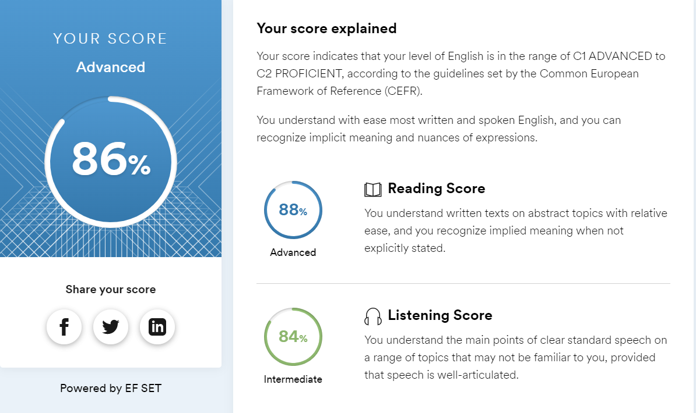

# **SVETLANA LAGUNOVA**

### CONTACTS
**Email:** lagunjera@yandex.ru  
**Discord:** @westeq#2871  
**Location:** Chebocksary, Chuvash Republic (RU)

### PROFILE 


### SKILLS
Basic knowledge of:
 - HTML5 + CSS3 + BEM
 - JS (ES6)
 - Python 3 + Pandas
 - Git/GitHub

### CODE EXAMPLE
**Python: String Letter Counting**
```python
def letterCounting(string):
    lettersList = list(filter(lambda x: x.isalpha(), string.lower()))
    countedLettersList = []

    for element in lettersList:
         newElement = str(lettersList.count(element)) + element
         if newElement not in countedLettersList:
             countedLettersList.append(newElement)        
    
    return "".join(sorted(countedLettersList, key = lambda x: x[-1]))
```

**JavaScript: Even or Odd**
```js script
function evenOrOdd(number) {
  if ((number % 2) != 0) return "Odd";
  return "Even";
}
```

### EXPERIENCE
- **JS + MArkdown:** this very CV:)   
  [GH-Pages](https://12fouronsix.github.io/rsschool-cv/cv)  
  [Source code](https://github.com/12FourOnSix/rsschool-cv/tree/gh-pages)  
- **Python (including Pandas)**: used a couple of times to automate some routine analysis work


### EDUCATION
- **2005-2010**  
  Economist, specialization "World economy"  
  Russian University of Cooperation (RUC)
- **2021**  
  Online course "JavaScript/DOM/Interfaces" by [learn.javascript.ru](https://learn.javascript.ru/)
  [Certificate](https://learn.javascript.ru/courses/jsbasic-20210520/lagunjera/en/certificate.jpg)

### ENGLISH LANGUAGE
I have pretty good listening and reading skills: 
  - **C1** according to the EPAM test,
  - **Advanced** level according to the [www.efset.org](https://www.efset.org) test  
    
But due to lack of experience in speaking and writing I still have a lot to learn.